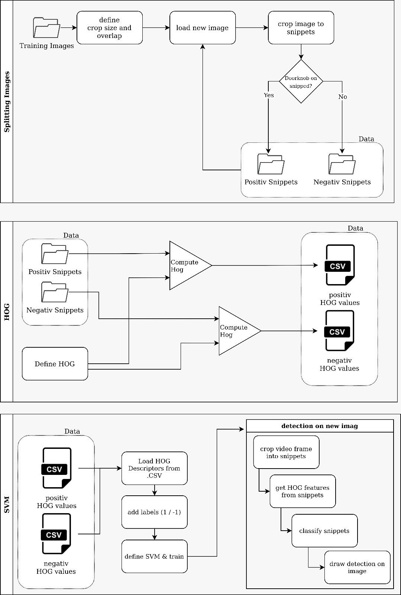
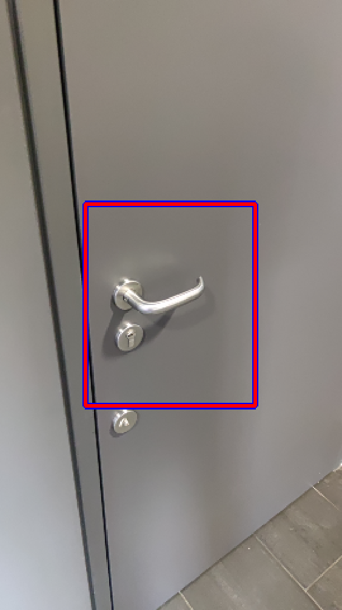
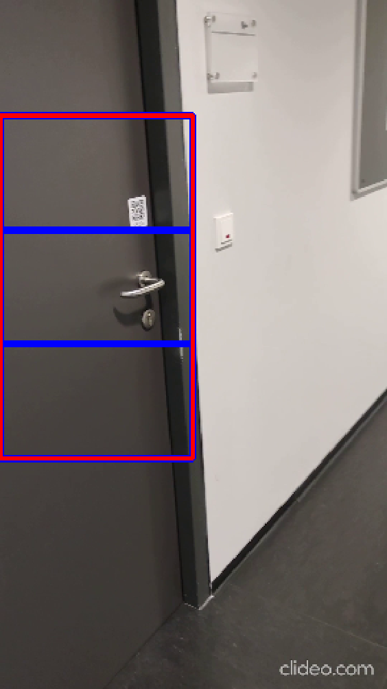
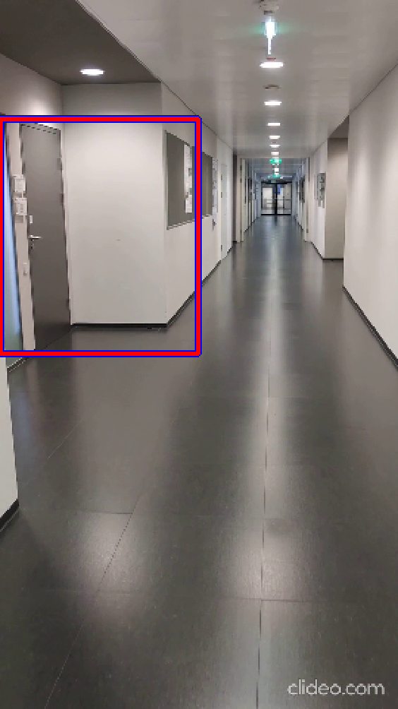

# HOG_SVM
This is our great MUS2 Project for a HOG SVM Doorknob detector  

## How to get the trainings data: 
- Download the Files: https://drive.google.com/drive/folders/1eQ5UWKaUYUpAuMhWf78MmCKgs6JhAncF?usp=sharing
- Add the images to the File Structure provided below in the images-path

## (File- )Structure

- .gitignore [FILE]
- SVM [FOLDER] -> contains the SVM itself
    - main.cpp [FILE]
    - Makefile [FILE]

- HOG [FOLDER] -> creates the .csv for the SVM 
    - main.cpp [FILE]
    - Makefile [FILE]

- Splitting_images [FOLDER]
    - main.cpp [FILE]
    - Makefile [FILE]
- Data [FOLDER]
    - negativ.csv [FILE] -> created by HOG Program
    - positiv.csv [FILE] -> created by HOG Program 
    - test [FOLDER] -> download via google drive link
    - images [FOLDER] -> download via google drive link
        - all_images [FOLDER] -> used by splitting images
        - split_images [FOLDER]
            - positiv [FOLDER]-> used for training
            - negativ [FOLDER]-> used for training
- Doku [FOLDER]
    - Ergebnisse_Screenshots [FOLDER]
    - html [FOLDER] -> created doxygen doku 
    - latex [FOLDER]
    

Complete Pipeline: 

## How to compile and execute: 
- enter >> make << in the Terminal within the wanted directory of the project.
- execute with >> ./HOGexe << or >> ./SVMexe <<

 

## Result

The following image shows a sample prediction based on the presented pipeline.
To see the full results start the SVM Programm and load the sample videos. 

 
(clideo.com was used to bulk resize images)
 

### Team: 
Abdank Moritz, mr20m001, lead, focus on overview, merging, data structure 
Egger Christoph, mr20m042, focus on splitting images / dataset 
Trivisonne Paolo, mr20m030 focus on HOG Program 
Wiesmüller Manuel, mr20m024 focus on SVM Program 